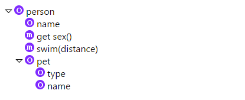

Extracting symbols from dynamic language is a bit awkward as symbol definitions may change dynamically at runtime. While it is impossible to derive accurate symbol structure statically, we can make the result much more useful by doing some extra analysis over the AST. Here are some examples demonstrating how we deal with JavaScript code in [JavaScriptExtractor](../src/main/java/com/gitplex/jsymbol/javascript/JavaScriptExtractor.java)

## Example 1

### Source code

```javascript
var globalVar;

function globalFunc(params) {
  var localVar1, localVar2;

  function localFunc() {
    globalVar.name = "robin";
    localVar1.name = "steve";
    otherVar.name = "andy";
  }
  
}
```
### Extracted symbols


 
### Explanation

1. _globalVar_ is extracted as a [ObjectSymbol](../src/main/java/com/gitplex/jsymbol/javascript/symbols/ObjectSymbol.java?mark=13.13-13.25). By analyzing the AST, we know that it has a property _name_
1. _otherVar_ is extracted as a [ObjectSymbol](../src/main/java/com/gitplex/jsymbol/javascript/symbols/ObjectSymbol.java?mark=13.13-13.25) to hold the property _name_, although itself is not defined in current file
1. _globalFunc_ is extracted as a [FunctionSymbol](../src/main/java/com/gitplex/jsymbol/javascript/symbols/FunctionSymbol.java)
1. _localVar2_ is NOT extracted as symbol as it is just a plain local variable
1. _localVar1_ is extracted as a [local](../src/main/java/com/gitplex/jsymbol/Symbol.java?mark=86.28-86.35) [ObjectSymbol](../src/main/java/com/gitplex/jsymbol/javascript/symbols/ObjectSymbol.java?mark=13.13-13.25) inside _globalFunc_ as it contains some interesting structures (property _name_ here)
1. _localFunc_ is extracted as a [local](../src/main/java/com/gitplex/jsymbol/Symbol.java?mark=86.28-86.35) [FunctionSymbol](../src/main/java/com/gitplex/jsymbol/javascript/symbols/FunctionSymbol.java)

Note that here we parsed into the function body to find out definition _otherVar.property3_ and _globalVar.property1_ as symbols can be defined anywhere in a dynamic language.

## Example 2

### Source code

```javascript
class Polygon {
  constructor(width, height) {
    this.width = width;
    this.height = height;
  }

  get width() {
    return this.width;
  }
 
  get height() {
    return this.height;
  }

  draw() {
    // draw the polygon
  }

}
```

### Extracted symbols


### Explanation

1. _Polygon_ is extracted as [ClassSymbol](../src/main/java/com/gitplex/jsymbol/javascript/symbols/ClassSymbol.java)
1. _constructor(width, height)_, _get width()_, _get height()_, and _draw()_ are extracted as [MethodSymbol](../src/main/java/com/gitplex/jsymbol/javascript/symbols/MethodSymbol.java) under class _Polygon_
1. We create _this_ as an [ObjectSymbol](../src/main/java/com/gitplex/jsymbol/javascript/symbols/ObjectSymbol.java?mark=13.13-13.25) to hold [ObjectSymbol](../src/main/java/com/gitplex/jsymbol/javascript/symbols/ObjectSymbol.java?mark=13.13-13.25) _width_ and _height_ inside the constructor
    
## Example 3

### Source code

```javascript
var foo = require("bar");

exports.draw = function() {
  // draw something
}
exports.sing = function() {
  // sing something
}
```

### Extracted symbols


### Explanation

1. We know that _require_ function is used by Node.js framework to import other modules, so we extract _foo_ as a [local](../src/main/java/com/gitplex/jsymbol/Symbol.java?mark=86.28-86.35) [ObjectSymbol] (../src/main/java/com/gitplex/jsymbol/javascript/symbols/ObjectSymbol.java?mark=13.13-13.25) (it is local as this variable will only be used in current file)
1. We create _exports_ as an [ObjectSymbol](../src/main/java/com/gitplex/jsymbol/javascript/symbols/ObjectSymbol.java?mark=13.13-13.25) to hold exported [FunctionSymbol](../src/main/java/com/gitplex/jsymbol/javascript/symbols/FunctionSymbol.java) _draw_ and _sing_

## Example 4

### Source code

```javascript
(function($) {
  $.fn.greenify = function() {
    this.css("color", "green");
    return this;
  }
}(jQuery));
```

### Extracted symbols


### Explanation
We also checks anonymous function body used in a function call, so we extract _greenify_ as a [FunctionSymbol](../src/main/java/com/gitplex/jsymbol/javascript/symbols/FunctionSymbol.java). _fn_, _$_ are extracted as [ObjectSymbol](../src/main/java/com/gitplex/jsymbol/javascript/symbols/ObjectSymbol.java?mark=13.13-13.25). We also created an anonymous [FunctionSymbol](../src/main/java/com/gitplex/jsymbol/javascript/symbols/FunctionSymbol.java) to reflect the correct hierarchy
    
## Example 5

### Source code

```javascript
var person = {
  name: "andy",
  get sex() {
    return "male";
  },
  swim(distance) {
    // do some exercise
  },
  pet: {
    type: "dog",
    name: "wangwang"
  }
}
```

### Extracted symbols


### Explanation

We analyzes JavaScript literal object declarations, and create corresponding symbols to reflect the object hierarchy

## Example 6

### Source code

```javascript
Vue.component("my-component", {
  props: ["message"],
  template: "<span>{{message}}</span>"
});
Vue.component("my-another-component", {
  props: ["message"],
  template: "<span>{{message}}</span>"
});
```

### Extracted symbols


### Explanation

We are aware of VueJS framework, and know that calling method _Vue.component_ will define a component. So we create _vueComponents_ as an [ObjectSymbol](../src/main/java/com/gitplex/jsymbol/javascript/symbols/ObjectSymbol.java?mark=13.13-13.25) to hold vue component _my-component_ and _my-another-component_